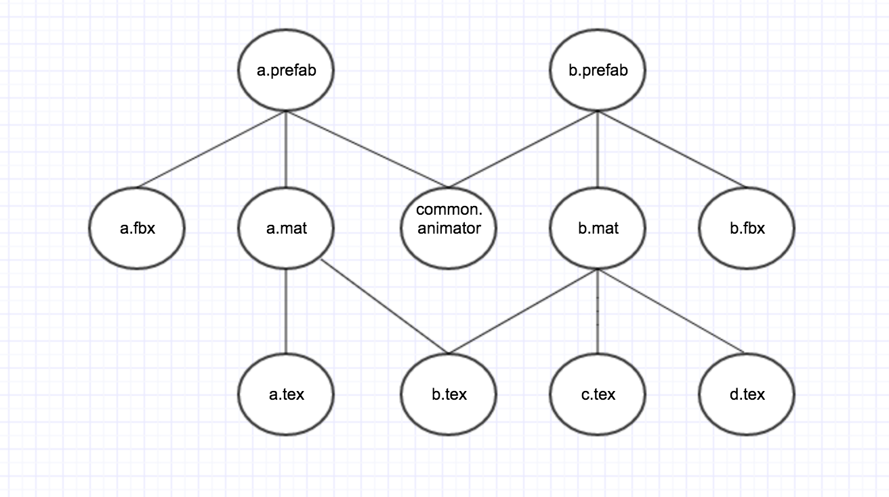

# unity热更新之Assetbundle打包篇
unity3d在5.0之后打包Assetbundle变得比之前简单多了，最简单的办法就是把所有资源都标记Assetbundle的Flag,然后直接调用unity3d的打包Assetbundle即可，详情可参见[官方文档](https://docs.unity3d.com/Manual/BuildingAssetBundles.html)。
## 通过标记打包方式的优缺点
这种打包方式的优点在于简单，缺点在于不好管理需要需要打包的资源。举例来说就是你必须把所有需要打包的资源都标记上Assetbundle的Flag,（包括prefab,texture,material,fbx,animation等），最后容易把资源打得特别散，造成每一个文件都是一个assetbundle。这样其实对于加载是特别不友好的，每一个assetbundle的引用都至少会有大约4kb的内存。如果不这样做，只对prefab做标记的话，容易造成资源的重复打包，一些texture，fbx可能会多次打进不同的assetbundle里。
## 通过buildmap方式打包的优缺点
unity还提供了一种buildmap的打包方式，可以自己管理需要打包的资源，优点在于自己管理依赖关系，可以最大程度的控制打包粒度，缺点就是需要写点代码，大约500行。
## 使用buildmap打包的流程
###1.目录管理
管理好你的资源目录，把需要单独打包和不需要单独打包的文件放在不同的目录下，默认需要单独打包的只有预制件目录，其他的目录一般可以根据依赖自动打进包里，可以参考下面的目录结构:
```
Assets
  |--Prefabs
     |--a.prefab
     |--b.prefab
  |--Textures
     |--a.tex
     |--b.tex
     |--c.tex
  |--Materials
  |--Aniamations
  |--Models
  |--Other
```
我们打包前会遍历Prefabs目录，得到每一个prefab的依赖，构建一棵依赖树，根据依赖树进行打包。

###2.构建依赖树
unity3d提供了 `AssetDatabase.GetDependencies`的方法来获取一个文件的依赖关系，我们假设遍历完预制件文件夹后得到的依赖关系如下：

```
a.prefab依赖于a.mat,a.fbx,common.animator;
b.prefab依赖于b.mat,b.fbx,common.animator;
a.mat依赖于a.tex,b.tex
b.mat依赖于b.tex,c.tex,d.tex
```

最终形成的依赖关系树如下：


***注意：构建依赖树时需要获取预制件的直接依赖，再依次获取每一个依赖文件的直接依赖，直到获取到最底层的依赖，由此构建出所有预制件形成的依赖树。***

###3.根据依赖树打包Assetbundle
+ 如果树的一个节点有2个或以上的父节点，则该资源被2个或多个其他资源所依赖，该节点需要打包成独立的Assetbundle。
+ 如果树的一个节点没有父节点，则该资源是最顶层的预制件，需要打包成独立的Assetbundle。
+ 打包时应该从最底层开始逐层向上遍历，在每一层寻找是否有节点的父节点数量大于1或者等于0，将满足条件的节点打成Assetbundle,直到遍历完整棵树。因为打包Assetbundle的时候是会将所有被依赖到的文件都自动打进Assetbundle里，所以从底层往上打包可以让上层的Assetbundle直接依赖到底层的Assetbundle,避免了资源被重复打进不同的Assetbundle里。
根据上面的树，最终打出来的Assetbundle如下：

```
	b.tex.assetbundle
	common.animator.assetbundle
	a.prefab.assetbundle
	b.prefab.assetbundle
```
这样既不会每一个文件都打出一个assetbundle,也省去了手动管理依赖关系的繁琐。
###4.关于场景的打包
因为unity3d 5.x之后的版本不再将光照贴图的信息存放在预制件中，因此如果做过光照烘焙的场景，就必须把预制件直接摆放在场景中，动态加载预制件将丢失光照贴图的信息。对于这种情况，摆放在场景中的预制件可以不放在最终打包的预制件目录中，因为打包场景的时候会将场景的资源都统一打包，不会依赖到你所打包的预制件，因此场景中的预制件建议单独存放目录。